# Omashell

A [Caelestia](https://github.com/caelestia-dots/shell)-style desktop shell for [Omarchy](https://omarchy.org), maintained by [Ozancann01](https://github.com/Ozancann01).

> **Omashell is built on [Omacale](https://github.com/AyushKr2003/omacale) by [AyushKr2003](https://github.com/AyushKr2003).** Nearly everything here started as Omacale: the frame, the bar, the drawers, the handovers and the settings app are AyushKr2003's work, which this fork extends (displays, profiles, night light, per-screen shell, theme sync, session menu, bar layout) under the same GPL-3.0 licence. All credit for the original goes to them; please star [the original](https://github.com/AyushKr2003/omacale) too.

[](LICENSE)
[](https://github.com/Ozancann01/omacale/releases/latest)


Omashell is a single Omarchy bar plugin (`omashell.bar`). It runs inside Omarchy's own shell: no extra daemon, no build step, no required Hyprland changes. Caelestia provides the look; Omarchy stays the engine.

## What Omashell adds to Omacale

Everything Omacale does, plus (details per version in the [changelog](CHANGELOG.md) and the [releases](https://github.com/Ozancann01/omacale/releases)):

| Area | What you get |
|---|---|
| **Displays** (Settings › Display) | See and arrange your screens, change resolution, refresh rate, scale, rotation, mirroring, variable refresh, colour and bit depth with a 30-second keep-or-revert, Identify labels, details per screen. Needs [hyprmoncfg](https://github.com/crmne/hyprmoncfg) for changes; read-only without it. |
| **Profiles** | Apply, save, delete hyprmoncfg layouts, automatic switching on or off. |
| **Display menu** | Extend / Mirror / Only laptop / Only external, from a key or when a screen is plugged in. |
| **Brightness** | A slider per screen (external ones over DDC), one brightness for every screen, the bar's scroll on its own screen, optional brightness keys that follow, turn a screen off for now. |
| **Night light** | Warmth and a schedule (sunset to sunrise, or custom times). |
| **Workspaces per screen** | Which workspaces live on which screen, saved in the profile. |
| **Shell on each screen** | Bar on/off and its edge per screen, and where the desktop clock, notifications and OSD show. |
| **Bar layout** | Drag any item between start, center and end; take items off and add them back; hide plugin widgets. |
| **Theme** | Pickers everywhere, a whole theme from your wallpaper, colours that match Omarchy exactly, optionally Omarchy's own menus in your colours. |
| **Session menu** | Super+Esc / power key open the session drawer, with Lock, Screensaver and your own picture. |
| **Text and cursor** | Omarchy's text size and a cursor size that match on every screen. |

## Screenshots

| | |
|---|---|
| 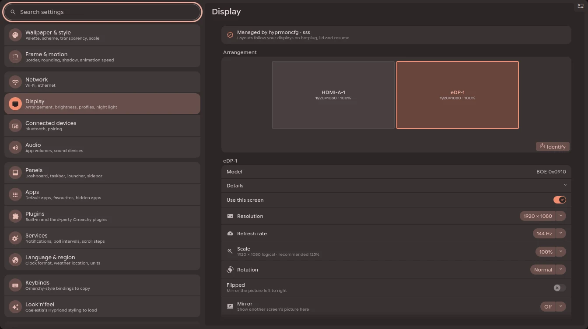 | 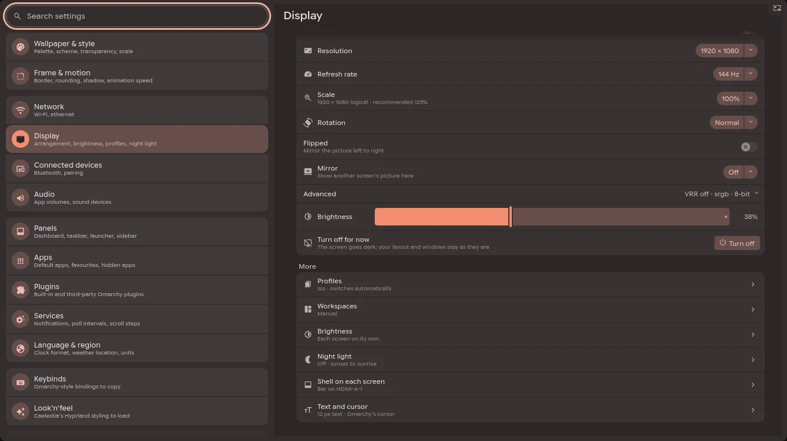 |
| **Display**: the arrangement (drag to move, Identify) and the selected screen | Brightness, *Turn off for now*, and every other screen setting one row away |
| 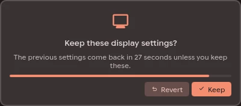 | 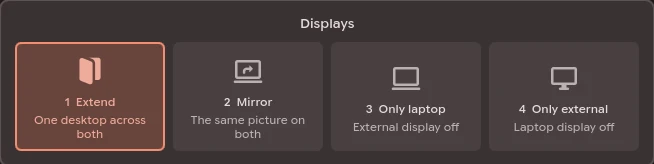 |
| Every change is tried for 30 seconds, then reverts unless you keep it | The display menu, from a key or when a screen is plugged in |
| 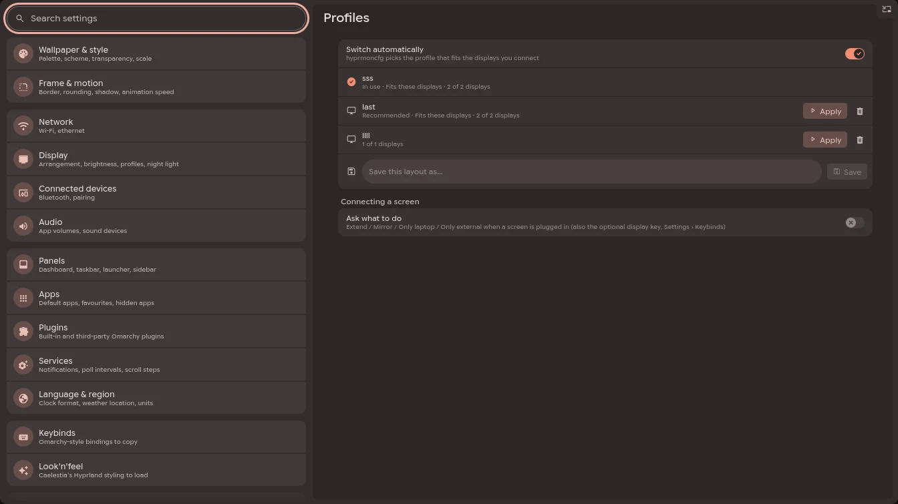 | 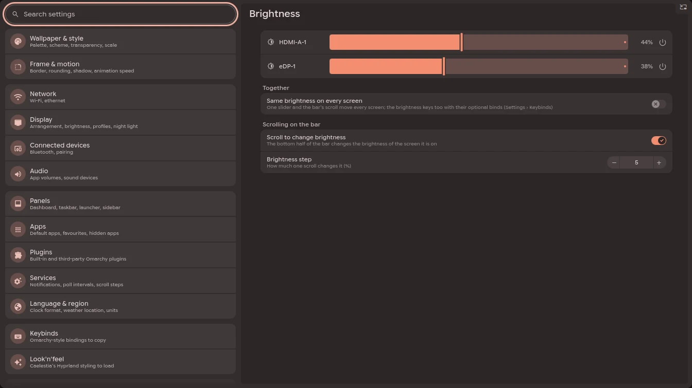 |
| **Profiles**: apply, save, delete, automatic switching | **Brightness**: every screen, one brightness for all, the bar's scroll |
| 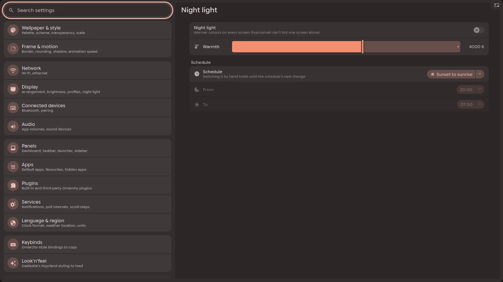 | 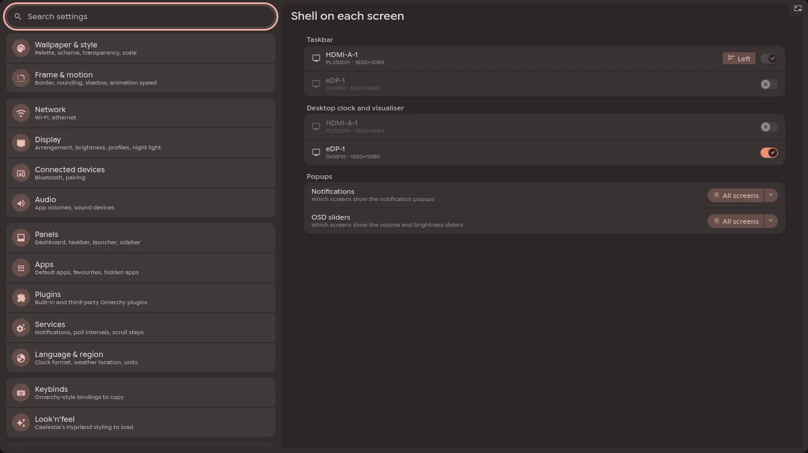 |
| **Night light**: warmth and a schedule | **Shell on each screen**: bar and its edge, desktop clock, popups |
| 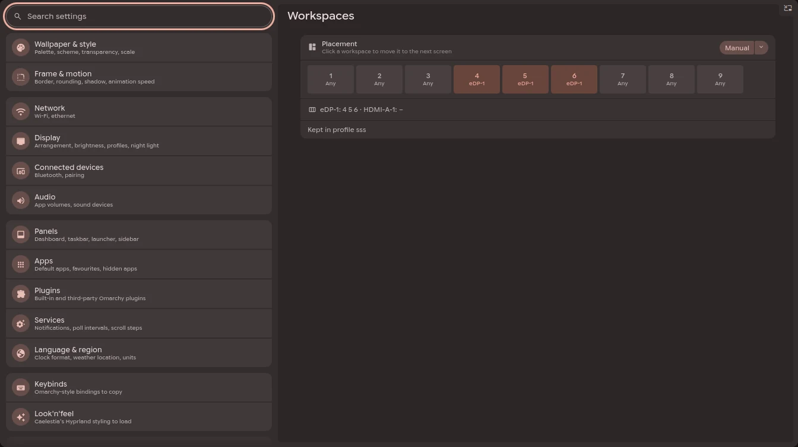 | 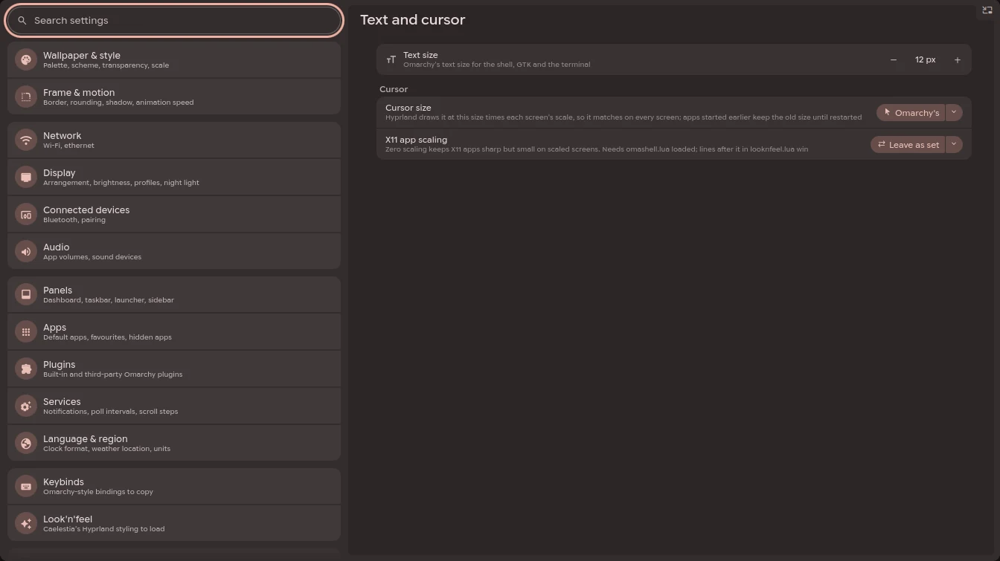 |
| **Workspaces** per screen | **Text and cursor** |
| 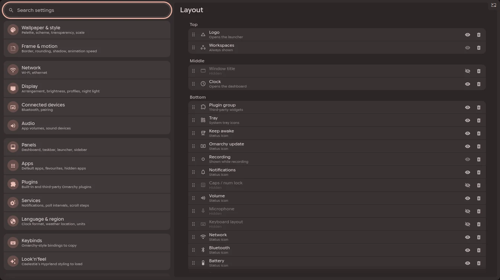 | |
| **Bar layout**: drag items between start, center and end | |

## Features

- **Frame and drawers**: Caelestia's shader-drawn screen frame, with dashboard, launcher, sidebar, utilities, session and settings sliding out of it.
- **Material 3 colours** generated from your Omarchy theme, or the theme's own colours, light or dark exactly as Omarchy decides it. Optionally Omarchy's own menus, popups and notifications follow the Material palette too (a marked, removable block in `~/.config/omarchy/shell.toml`).
- **Bar**: workspaces, active window (live preview and window actions), tray, clock, status icons and popouts. Crowded items collapse on their own. Every item can be dragged to the bar's start, center or end, single status icons and plugin widgets included, or taken off the bar and added back later (Settings › Taskbar › Layout). It can sit on any edge of the screen (Settings › Taskbar › Position: left, right, top, bottom, or follow Omarchy's own bar position); the frame, drawers and popouts follow it. With several screens, each can have its own edge or no bar at all, and the desktop clock, toasts and OSD can be kept to the screens you choose (Settings › Taskbar › Screens, Panels › Desktop, Notifications, OSD).
- **Display**: everything about your screens is in Settings › Display (Super+Ctrl+D): the main page has the arrangement and the selected screen, and sub-pages hold Profiles, Workspaces, Brightness, Night light, Shell on each screen (bar, desktop clock, notification and OSD screens) and Text and cursor; the other pages link there. It shows how your screens are arranged, each one's model, resolution, scale and position, **Identify** labels on every screen, a brightness slider per screen (external ones over DDC where they support it), Omarchy's text size, the laptop panel and mirroring, and a cursor size that matches on every display. With hyprmoncfg managing your displays you can also change them there: drag them into place, and pick resolution, refresh rate, scale (sharp scales only, with one marked as recommended for the display's size), rotation, mirroring, variable refresh rate, colour and bit depth. **Apply** tries the change for 30 seconds behind a "Keep these display settings?" card on every screen (Enter keeps, Escape reverts) and puts the old layout back unless you keep it; hyprmoncfg's daemon runs that clock, so it reverts even if the shell is gone. Kept changes are saved in the profile you're using. **Profiles** lists hyprmoncfg's saved layouts (in use, recommended, which fit the connected displays): apply one with the same keep-or-revert card, delete one, save the current layout under a name, or turn automatic switching off to keep the one you chose. A **display menu** (Extend / Mirror / Only laptop / Only external, like Win+P elsewhere) opens from `omarchy-shell omashell display menu`, the optional laptop display key or Super+P bind (Settings › Keybinds), or by itself when a display is connected if you turn that on; the choice goes through the same keep-or-revert card. **Turn off for now** darkens one screen (the others stay on, your layout too) until you turn it back on, lock the screen or resume; there's also a power button per screen on the Displays card. With **Same brightness** on, optional brightness-key binds (Settings › Keybinds) move every display together. **Night light** (Omarchy's hyprsunset, every display) gets its warmth and a schedule: sunset to sunrise from your weather location, or custom times; switching it by hand holds until the schedule's next change. **Workspaces** sets which workspaces live on which screen (by hand, in order, or taking turns), saved in the profile with the same Apply. Each display's **Details** show its connector, serial, size, pixel density, colour format and workspace. Without hyprmoncfg the page shows Hyprland's state, read-only. The utilities drawer gets a **Displays** card with a slider per screen once you have two or more, and scrolling on a bar changes the brightness of the screen that bar is on. **Same brightness on every display** (on the page, or the link button on the card) turns that into one slider that moves every screen together, the bar scroll included.
- **Pickers everywhere**: Settings › Wallpaper & style, the `:` menu's Style › Theme / Background and the picker binds all open Omashell's carousels (or Omarchy's menus, if you prefer), and **From wallpaper** builds a whole Omarchy theme from your wallpaper with aether, when it is installed.
- **Launcher**: apps, calculator (`>calc`), clipboard history (`>clipboard`), wallpaper and theme pickers (`>wallpaper`, `>theme`), and the Omarchy menu (`:`).
- **Dashboard**: weather, calendar, system resources, and media with synced lyrics.
- **Notifications**: toasts that stay above fullscreen windows, plus a history sidebar.
- **OSD**: Caelestia's sliders slide out of the right edge when you change the volume or brightness, or when you hover there, and every other Omarchy OSD (media, microphone, keyboard backlight, input devices, power, app launches) shows as a Caelestia toast.
- **Status toasts**: Caelestia's small toasts above the utilities corner for do not disturb, game mode, the charger, and audio device changes (Settings › Notifications › Toasts).
- **Session menu**: Caelestia's drawer with your own icons, commands and picture, Omarchy's suspend/hibernate checks, plus Lock and Screensaver; optional binds make Super+Esc and the power key open it (falling back to Omarchy's System menu when locked or when Omashell isn't running).
- **Workspace overview** with live previews and drag-and-drop.
- **Lock screen**: Caelestia's design on top of Omarchy's own lock and PAM.
- **Desktop clock and audio visualiser** (optional).
- **Plugin manager** and hosting for third-party Omarchy bar widgets. Each widget can be pinned, kept behind the plugin pill's chevron, or hidden from the bar (Settings › Taskbar › Plugins).
- **Keyboard-driven**: every panel works with `h` `j` `k` `l`, Enter and Escape.
- **Settings app** for everything above, applied live.
- **UI scale**: follows Omarchy's font size (`[font] base-size` in `~/.config/omarchy/shell.toml`) or a size of your own, with separate text, padding, spacing and rounding scales. Unlike Caelestia, the drawers and bar scale with it too, so a smaller UI also takes less room. With `omashell.lua` loaded, Hyprland's gaps and window rounding follow as well: window corners stay concentric with the frame (window radius = frame radius − gap).

## Requirements

**Required**

- [Omarchy](https://omarchy.org) 4.0 or newer, with its shell running (tested on Omarchy 4.0.4, Hyprland 0.56 with the Lua config, Quickshell 0.3)
- Material Symbols Rounded font (the installer adds `ttf-material-symbols-variable` if missing)
- Already part of Omarchy, nothing to install: `jq`, `python3`, `curl`, `wl-clipboard`, and for the new features `ddcutil` (brightness of external screens), `hyprsunset` (night light) and `aether` (theme from your wallpaper)

**Optional**

| Package | For | Without it |
|---|---|---|
| [hyprmoncfg](https://github.com/crmne/hyprmoncfg) (AUR: `hyprmoncfg-bin`, with its daemon `hyprmoncfgd` running; `hyprmoncfg manage` or the **Manage** button in Settings › Display) | Changing your screens (resolution, scale, arrangement, mirroring…), keep-or-revert, Profiles, Workspaces per screen, the full display menu | Settings › Display shows your screens read-only; brightness, *Turn off for now*, night light, text and cursor, and Shell on each screen still work, and the display menu offers Extend / Mirror / Only external through Omarchy's own laptop-screen switches |
| `cava` (the installer offers it) | The music visualiser on the desktop | No visualiser |
| DDC/CI turned on in your monitor's own menu | Brightness sliders for external screens | External screens show no brightness slider |
| Weather location set (Settings › Language & region) | Night light from sunset to sunrise | Use custom times instead |

## Install

```bash
git clone https://github.com/Ozancann01/omacale.git omashell
cd omashell
./install.sh
```

The installer copies the plugin to `~/.config/omarchy/plugins/omashell.bar`, makes it the active bar, and records your previous setup so it can be restored.

**Coming from Omacale?** Run the same `./install.sh`: it carries your Omacale settings, state and Hyprland binds over to Omashell (backups in `~/.local/state/omashell/`), rebuilds the hand-overs and sets the old plugin folder aside.

To install a specific version, pick one from [Releases](https://github.com/Ozancann01/omacale/releases) (`git checkout v0.62.0`, then `./install.sh`).

To update, pull and run the installer again. It upgrades in place: new plugin files, the notification and lock-screen handovers rebuilt for your Omarchy, and a shell restart. Your settings are kept, and `./uninstall.sh` still restores the setup from before the first install.

```bash
git pull
./install.sh
```

| Command | Purpose |
|---|---|
| `./uninstall.sh` | Restore your previous bar exactly |
| `scripts/omashell status` | Show what is installed |
| `scripts/omashell doctor` | Check the installation |
| `scripts/omashell install --dry-run` | Preview an install |
| `scripts/omashell install --dev` | Symlink the plugin for development |

### Optional setup

- **Keybindings**: copy them from **Settings › Keybinds**, or paste [`keybinds.lua`](keybinds.lua) into `~/.config/hypr/bindings.lua`.
- **Window styling** (Caelestia borders, animations and shadows): add to `~/.config/hypr/looknfeel.lua`:

  ```lua
  pcall(dofile, os.getenv("HOME") .. "/.config/omarchy/plugins/omashell.bar/omashell.lua")
  ```

- **Notification toasts** and the **volume and brightness OSD**: offered during install, on by default (`--osd` / `--no-osd` skip the question for the OSD).
- **Lock screen**: off unless you say yes at the prompt or pass `--lock-screen` (see [Omarchy integration](#omarchy-integration) for why).
- Change any of them later in **Settings › Notifications**, **Settings › Panels › Lock screen** and **Settings › Panels › OSD**.
- **Removing Omashell**: use `./uninstall.sh`. `omarchy plugin remove omashell.bar` removes only the bar and leaves Omashell's copies of the notification, lock and OSD plugins in place (they fall back to Omarchy's own drawing, but stay installed).

## Usage

### Keybindings

| Key | Action |
|---|---|
| `SUPER + A` | Launcher |
| `SUPER + D` | Dashboard |
| `SUPER + N` | Notifications sidebar |
| `SUPER + U` | Quick toggles |
| `SUPER + TAB` | Workspace overview |
| `SUPER + SHIFT + I` | Settings |
| `SUPER + SHIFT + ESCAPE` | Session menu |
| `SUPER + CTRL + 0` | Bar focus: move through the bar with the keyboard |
| `SUPER + CTRL + W` / `B` / `P` / `A` | Network / Bluetooth / Power / Audio popout (Omarchy's own keys) |
| `SUPER + CTRL + 1..9` | Third-party bar widgets, in bar order (Omarchy's own keys) |

### Keyboard navigation

A focus ring appears only when you use the keys, so mouse use is unchanged.

| Key | Action |
|---|---|
| `h` `j` `k` `l` / arrows | Move |
| `Enter` / `Space` | Activate |
| `Tab` / `Shift + Tab` | Next / previous popout or tab |
| `x` | Remove (network, device, notification, recording) |
| `Escape` | Close, or go back to the bar |

<details>
<summary>Keys for each panel</summary>

| Panel | Keys |
|---|---|
| Bar focus | `1..9` switch workspace; `Menu` or `Shift + F10` opens a tray item's menu |
| Tray menu | `→` open submenu, `←` back, a letter jumps to an entry |
| Network | `r` rescan |
| Audio | `m` mute; `←` / `→` on the slider change the volume |
| Dashboard | Moving along the tabs opens them; `1..4` jump to a tab; `n` / `p` change track |
| Sidebar | `d` do not disturb, `Shift + X` clear all |
| Settings | `/` search, `Backspace` previous page |
| Launcher `:` menu | Type to filter; `Enter` / `→` open, `Backspace` / `←` back |
| Launcher `>clipboard` | Type to filter; `Enter` paste, `Shift + Enter` copy, `Alt + Enter` open, `Delete` remove, `Shift + Delete` clear all |

</details>

### Command line

```bash
omarchy-shell omashell <launcher|dashboard|sidebar|utilities|overview|session|settings|close>
omarchy-shell omashell <wallpapers|themes|menu|clipboard|windowInfo|barFocus>
omarchy-shell omashell dashboardTab <dashboard|media|performance|weather>
omarchy-shell omashell settingsPage <page>
omarchy-shell omashell popout <network|bluetooth|audio|battery|kblayout|lockstatus|update|activewindow>
omarchy-shell omashell scale <omarchy|0.5-2|50%-200%>                  # empty prints the current scale
omarchy-shell omashell toast <info|success|warning|error> <title> <message> <icon>
```

## Omarchy integration

Omashell changes how things look, never how they work underneath.

- **Notifications**: Omarchy's daemon keeps the server, do not disturb and history. Omashell only draws the toasts, and only while it is the running bar with **Show popups** on. Otherwise (a bar that failed to load, another bar, Show popups off) Omarchy's own toasts come back within a second, without a restart.
- **Lock screen**: Omarchy keeps the session lock, PAM and idle timers. Omashell only draws the view, and Omarchy's view comes back if Omashell is off or missing. That view runs inside Omarchy's lock service and is given what is typed into the password field, to draw it; Omarchy otherwise keeps third-party code away from its authentication services. That is why the lock screen is opt-in. It also only installs on an Omarchy lock service Omashell was verified against; after an Omarchy update that changes it, Omarchy's own lock screen is restored until an Omashell update catches up. On the lock screen, notifications are hidden by default and, when shown, are read-only: no actions, links, copying or dismissing.
- **OSD**: Omarchy keeps the keys and the brightness control and still decides when an OSD is shown; Omashell draws them all, volume and brightness as sliders and the rest as toasts (or only the sliders, with Settings › Panels › OSD › Other OSD messages off). It hands them back while a window is fullscreen, and when Omashell isn't the bar.
- **Scale**: by default Omashell follows the size set in Omarchy's `shell.toml` (`[font] base-size`, `[spacing] scale`), so the stock bar and Omashell grow and shrink together.
- **Updates**: when `omarchy update` changes those plugins, Omashell rebuilds its copies from the new version. If a copy stops working, Omarchy's original is restored automatically and you get a notification.

<details>
<summary>Manage the handovers by hand</summary>

```bash
scripts/notif-popups <status|install|remove|health>
scripts/lock-screen  <status|install|remove|health>
scripts/osd-handover <status|install|remove|health>
```

</details>

## Development

```bash
./scripts/omashell install --dev                                          # live-editing symlink
rsync -a --exclude .git ./ ~/.config/omarchy/plugins/omashell.bar/ && omarchy-restart-shell
bash tests/test-restore.sh                                               # test suite
node tests/test-layout.js                                                # bar layout model tests
node tests/test-binds.js                                                 # keybinds.lua parser tests
node tests/test-theme-mode.js                                            # light/dark rule tests
bash tests/test-shell-toml.sh                                            # shell.toml colour block tests
node tests/test-screens.js                                               # per-screen rules tests
scripts/upstream-check                                                   # what changed in Omarchy since last verified
```

Architecture, conventions and design tokens are documented in [`CLAUDE.md`](CLAUDE.md).

## Limitations

- The OSD sliders and the toasts live in the frame, so a fullscreen window hides them. Over a fullscreen window Omarchy's own OSD shows instead.
- Caelestia's battery level warnings aren't ported, since Omarchy's battery service already sends them. Its VPN and keyboard layout toasts aren't either, since Omashell has neither feature.
- The lock screen shows the wallpaper by default. With **Use the wallpaper** off it shows a blurred snapshot of the screen, as Caelestia does; if the snapshot can't be taken (the display is off, say), it falls back to the wallpaper. With a video wallpaper, the blur applies to its still frame only.
- Notifications support their default action only; there are no inline replies (Caelestia has none either).

## Credits

- **Original shell: [Omacale](https://github.com/AyushKr2003/omacale) by [AyushKr2003](https://github.com/AyushKr2003)** (GPL-3.0). Omashell is a fork of it.
- UI and shaders: [caelestia-dots/shell](https://github.com/caelestia-dots/shell) (GPL-3.0)
- Workspace overview: adapted from [omarchy-overview](https://github.com/AyushKr2003/omarchy-overview) and [quickshell-overview](https://github.com/Shanu-Kumawat/quickshell-overview)
- Fonts: Google Sans Flex and Rubik (SIL Open Font License)

## License

[GPL-3.0](LICENSE)
